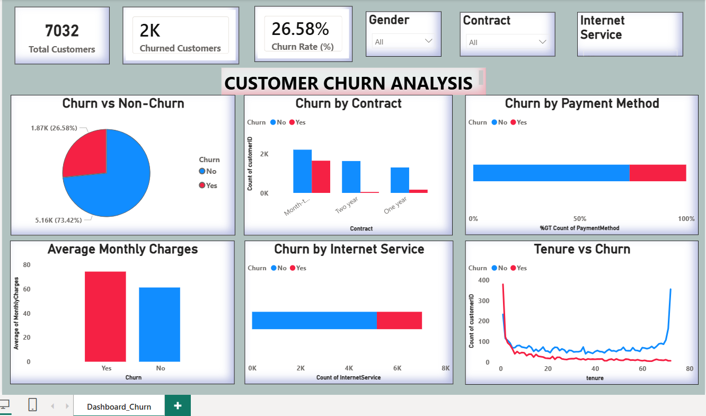
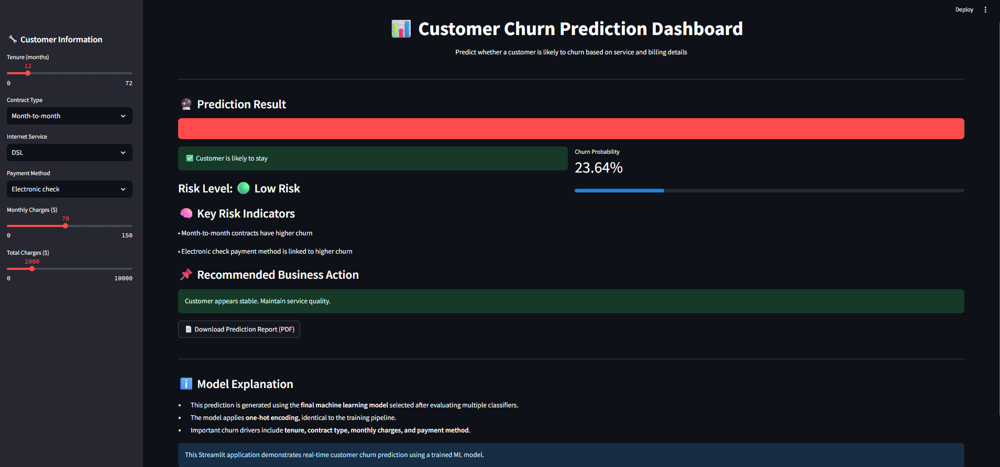

# 📊 Customer Churn Prediction Using Machine Learning


---

## 🚀 Project Overview

This project presents an end-to-end **Customer Churn Prediction System** using:

- 📊 Power BI for Exploratory Data Analysis (EDA)
- 🤖 Machine Learning models for prediction
- 🌐 Streamlit for real-time deployment
- 📄 Downloadable PDF reporting

The objective is to predict whether a customer is likely to churn based on service and billing details.

---

## 🎯 Problem Statement

Customer churn leads to revenue loss and customer acquisition cost increase.  
The goal of this project is to:

- Analyze churn patterns
- Build predictive models
- Deploy a real-time churn prediction dashboard
- Provide actionable business recommendations

---

## 📂 Dataset Description

- Dataset: Telco Customer Churn Dataset
- 7032 customer records
- Includes:
  - Demographics
  - Service details
  - Contract information
  - Billing information
- Target Variable: **Churn (Yes / No)**

---

## 🧠 Feature Engineering

Three feature sets were evaluated:

### 🔹 FS_1 – Core Numerical Features
- Tenure
- MonthlyCharges
- TotalCharges

### 🔹 FS_2 – Service & Contract Features
- FS_1 +
- Contract
- InternetService
- PaymentMethod

### 🔹 FS_3 – Full Feature Set
- FS_1 + FS_2 +
- Service-level features (OnlineSecurity, TechSupport, etc.)
- One-hot encoded categorical variables

Different classifiers performed best with different feature sets.

---

## 🤖 Models Implemented

The following 8 classifiers were trained and evaluated:

1. Logistic Regression
2. Support Vector Machine (SVM)
3. Decision Tree
4. Random Forest
5. Gradient Boosting
6. AdaBoost
7. Stochastic Gradient Boosting (SGB)
8. XGBoost

---

## 📊 Model Evaluation Metrics

Models were compared using:

- Accuracy
- Precision
- Recall
- F1 Score
- Cross-Validation
- ROC-AUC

### 🏆 Best Performing Model
Gradient Boosting (FS_2) achieved the highest F1 Score.

---

## 📈 Power BI Dashboard

EDA was performed using Power BI to analyze:

- Churn distribution
- Churn by contract type
- Churn by internet service
- Tenure vs churn
- Monthly charges impact

Insights from EDA guided feature selection.

---

## 🌐 Streamlit Deployment

The final model was deployed using Streamlit with:

- Real-time churn prediction
- Probability display
- Risk level classification (Low / Medium / High)
- Key risk indicators
- Business recommendation
- Downloadable PDF report

To run locally:

```bash
streamlit run app.py
```

## 🗂 Project Structure

```
Customer-Churn-Prediction/
│
├── app.py
├── final_churn_model.joblib
├── final_feature_list.joblib
├── model_results_summary.csv
├── README.md
└── screenshots/
```

---

## ⚙️ Installation

Install required dependencies:

```bash
pip install -r requirements.txt
```

Example dependencies:

- streamlit
- pandas
- scikit-learn
- xgboost
- joblib
- reportlab

---

## 📌 Business Impact

- Identifies high-risk customers
- Enables targeted retention strategies
- Reduces revenue loss
- Supports data-driven decision making

---

## 🎓 Key Learning Outcomes

- Feature engineering experimentation
- Hyperparameter tuning
- Model comparison
- One-hot encoding alignment
- End-to-end ML deployment
- Dashboard storytelling

---

## 📄 Downloadable Report Feature

The application generates a structured PDF report containing:

- Customer input summary
- Prediction result
- Churn probability
- Risk level
- Recommended business action

---

## 📊 Dashboard Preview

### 🔎 Power BI – Exploratory Data Analysis



**Insights Generated:**
- Churn distribution analysis
- Contract type vs churn comparison
- Tenure impact on churn
- Monthly charges influence
- Internet service behavior analysis

---

### 🌐 Streamlit – Real-Time ML Deployment



**Features Implemented:**
- Live churn prediction
- Churn probability display
- Risk classification (Low / Medium / High)
- Key churn indicators
- Business recommendations
- Downloadable PDF report

---


## 📢 Final Summary

This project demonstrates a complete data science pipeline:

> EDA → Feature Engineering → Model Training → Evaluation → Deployment → Reporting

---

### ⭐ If you found this project interesting, feel free to star the repository!
